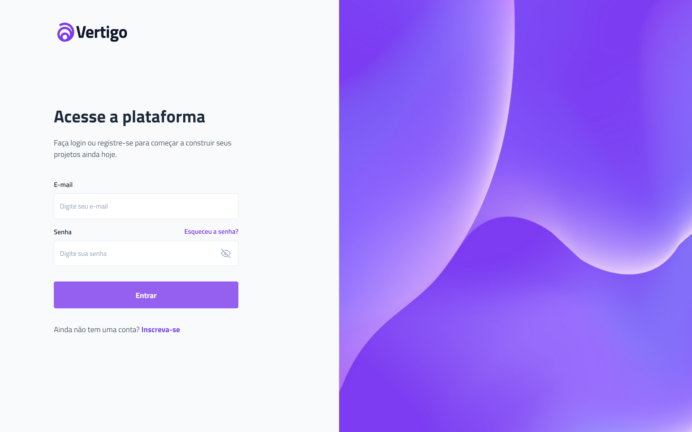

<h1 align="center"> Tela de Login - BoraCodar#11 </h1>

[Clique aqui para acessar](https://maik-emanoel.github.io/login-screen/)

## 🚀 Tecnologias

Esse projeto foi desenvolvido com as seguintes tecnologias:

- HTML
- CSS
- JavaScript
- Git and GitHub

## 💻 Projeto

Uma tela de login que inclui validações e uma mensagem de sucesso para indicar que a validação foi bem-sucedida. 

Obs: Projeto construído a partir do layout proposto no desafio [#BoraCodar11](https://boracodar.dev/) realizado pela [Rocketseat](https://rocketseat.com.br).
Após o desenvolvimento do projeto inicial, adicionei novas features, tais quais:

- Layout responsivo (Adaptado para telas menores)
- Validações no input email e password
- Animação na entrada da mensagem de sucesso
- Entre outras pequenas modificações.

## 🔖 Layout

Você pode visualizar o layout do projeto proposto através [DESSE LINK](https://www.figma.com/community/file/1217810469465160264). É necessário ter conta no [Figma](https://figma.com) para acessá-lo.